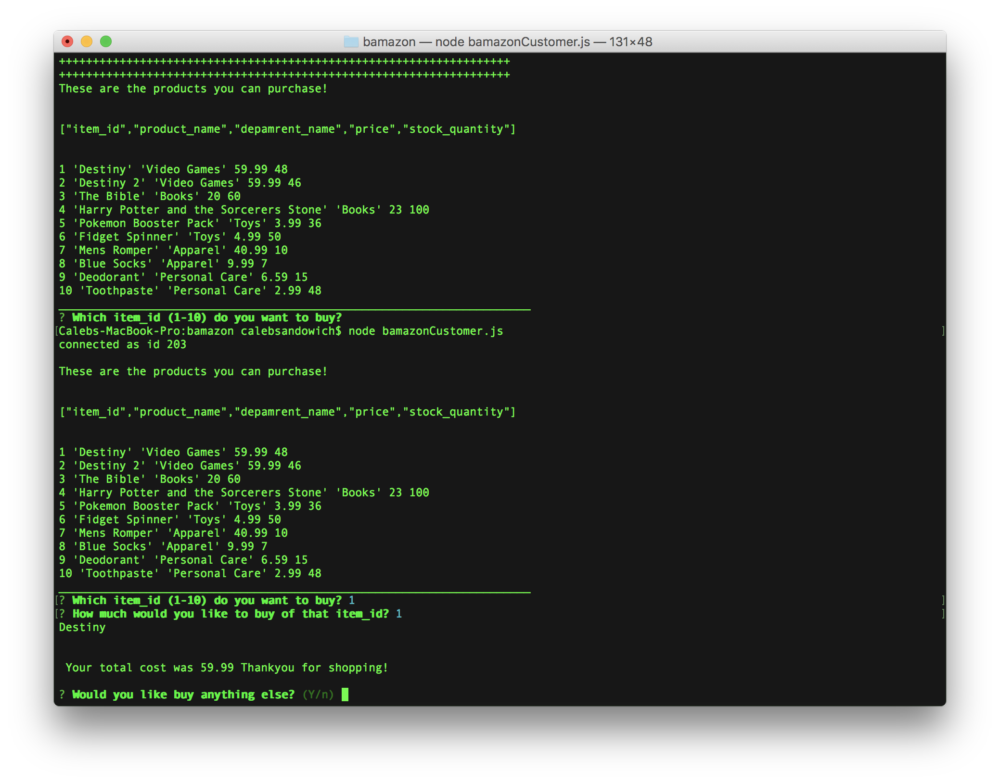
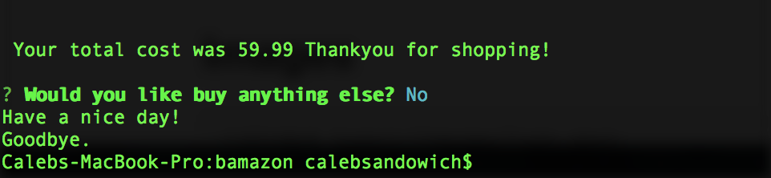

## bamazon
Simple CLI App clone of amazon that allows the user to look through specified products and purchase them.

You run the node app with **node bamazonCustomer.js**.

You then follow the prompts.
1. Which item_id (1-10) do you want to buy?

2. How much would you like to buy of that item_id?
If you select more than we have in stock you will see an error message.

Otherwise the total of your bill will be added and then you will be asked if you would like to buy anything else.

If you press **y** and **enter** then the purchase list will repopulate with updated stock quantities.

If you select **n** instead of **y** then "Have a nice day! Goodbye." will be the response message and then it will quit the app.

Video link showing the running app.
https://youtu.be/VBFvmwu4YZc - automatic!
